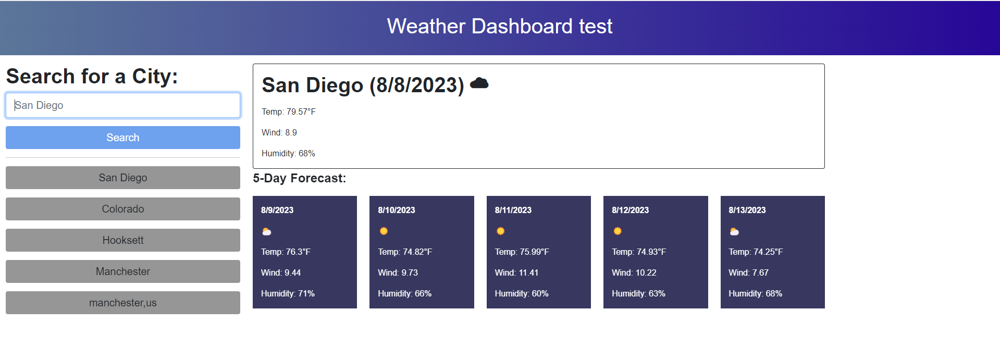

# Trevors-Weather-Dashboard
Use APIs to create a Weather Dashboard.  

## Project Description
Using the "5 day weather forecast" weather information will be provided on towns and cities.  The info that will be displayed based off the buttton that was pressed or the text that was inputed.  
Initial page:  
  
Page With Results:  
  

## How to Get to the Page  
The link to the repo for this project is located at: https://github.com/blanchardt/Trevors-Weather-Dashboard   
You can use this link to get to the live site: https://blanchardt.github.io/Trevors-Weather-Dashboard/   

## Credits  
Modified by: Trevor Blanchard 
API used: https://openweathermap.org/forecast5  

### script.js:  

line 209:  
Went to https://stackoverflow.com/questions/9792927/javascript-array-search-and-remove-string to figure out how to remove a
specific element in an array.  
Rolando, Tyrannas, Rob W, enesn, qwertymk, Matt, siva gopi, Ali Soltani, Eliav Louski, hvgotcodes, Ben Clayton, Pawan  
&nbsp;&nbsp;&nbsp;&nbsp;&nbsp;Dhangar, chepe263, &amp; dpmemcry. (2012, March 20). Javascript array search and remove string?. Stack Overflow. 
&nbsp;&nbsp;&nbsp;&nbsp;&nbsp;https://stackoverflow.com/questions/9792927/javascript-array-search-and-remove-string 